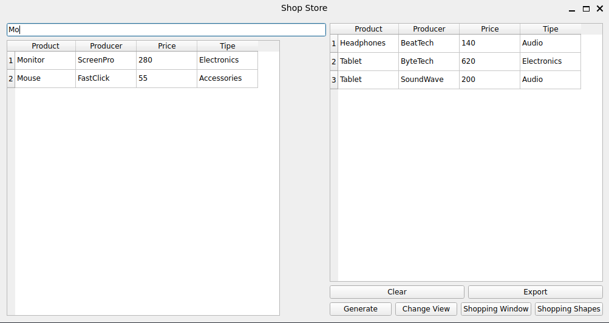
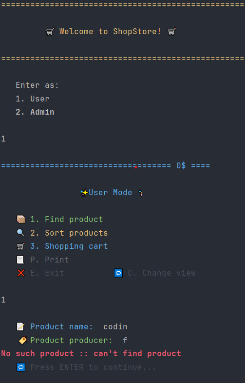
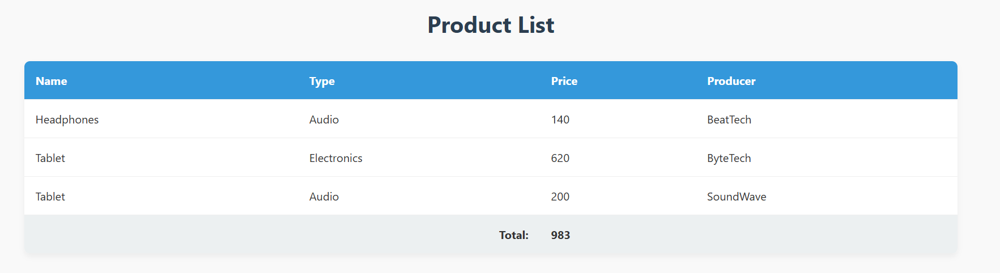

<h1>
  
  TankingTanks DBSM
</h1>

###  About the app
**Shop Store** is an app that manages a shop. It has a .`txt` "database" where it stors items, and it can make shoping carts for users, that can be later exported as `CVS` or `HTML`. The app has a consol UI, but also a GUI made in `QT`.

## 📷 Application Preview from QT

<p align="center">
  
</p>

## 📷 Application Preview from console

<p align="center">
  
</p>

To change between consol UI and GUI you just need to uncomment some code:
```C++
//#include "Ui/Controller/controller.h"
#include "GUI/guiController.h"

int main(int argc, char *argv[]) {
	QApplication app(argc, argv);
	/// run all test
	run_all_tests();
	std::cout << "Passed all tests!\n";

	// Controller controller(50, "   ", "../Utilities/productData.txt");
	// controller.run();

	 guiController controller("../Utilities/productData.txt");
	 controller.startApplication();
	 controller.show();

	return QApplication::exec();
}
```

## 📝 Export of the shoping cart

<p align="center">
  
</p>
