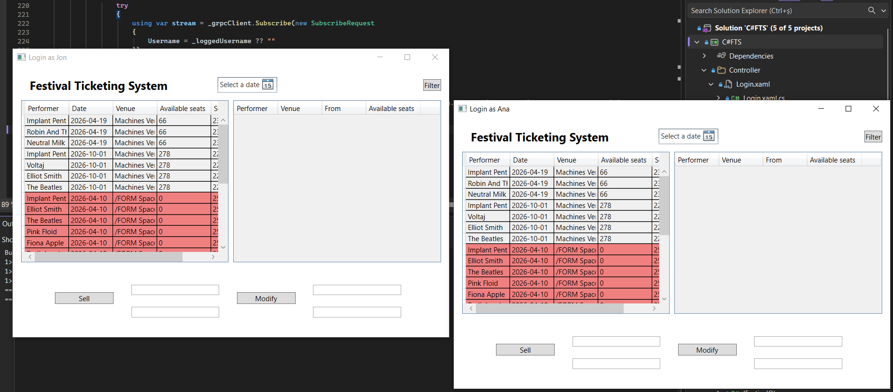

# Festival Ticketing System
This is a Client-Server application with the server in Java and the Client in C#. The Server has two implementation, one with Pattern Remote-Proxy made by hand and one what with **gRPC**.

  

## Technology used

### Spring
In this project Sping was used just for IoC

### gRPC
