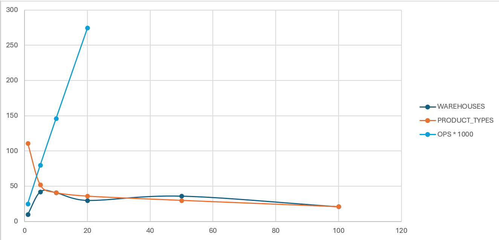
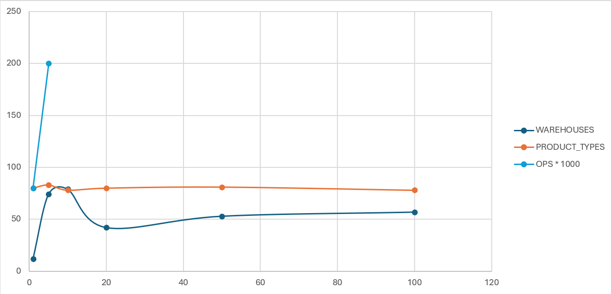

## Result and documentation of the locking

For every test set of data I made 5 test to see if the result are consistent. The main things that I changed are:
```c++
constexpr int WAREHOUSES = 10;
constexpr int PRODUCT_TYPES = 5;
constexpr int THREADS = 10;
constexpr int OPS = 10000;
constexpr int MAX_MOVE = 20;
```
Thous were the default values. To see the impact of each I changed each from 1 to 5, 10, 20, 50, 100 and got the next results!

### Locking every product separately


### Locking every warehouse separately


The "missing" data is because the values were exponentially bigger and the values that we have show the rapid increase!

> [!NOTE] This test were done on an 16GB RAM, NVIDIA GTX 1650 with a Ryzen 5 processor laptop